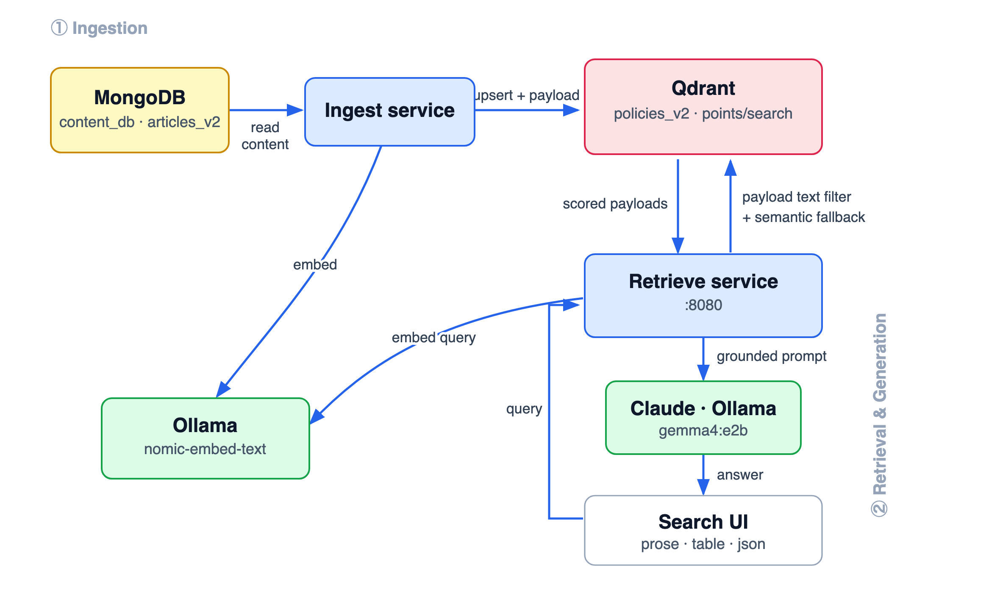

# 🚀 Enterprise Go RAG Stack: MongoDB Content, Qdrant Vectors & Web UI

A highly decoupled, professional microservices RAG (Retrieval-Augmented Generation) pipeline written in Go. This architecture separates primary content storage from specialized vector search, utilizing **MongoDB** as the raw document database, **Qdrant** as the high-dimensional vector search index, and **Ollama** or **Claude** for AI response generation.

---

## 📊 Visual Data Flow Diagram (DFD)

<p align="center">
  
</p>

---

## 🔄 Execution Flow

1. **Seeding Phase**: The Content Seeder connects to MongoDB and seeds raw policy documents into `content_db.articles_v2`.
2. **Ingestion Phase**: The Ingestion Service reads MongoDB source text, generates embeddings with Ollama, creates a Qdrant collection named `policies_v2`, creates a text index on the `content` payload field, and upserts vectors with payloads.
3. **Retrieval Phase**: The Retrieval HTTP Server serves the static dashboard at `localhost:8080`. When a query comes in:
   - It embeds the query text using Ollama `/api/embed`.
   - It searches Qdrant `policies_v2` using `points/search`.
   - For single-token keyword queries, it adds a Qdrant payload text filter against `content`.
   - If the filtered search returns zero matches, it retries with raw vector similarity.
   - It constructs an augmented prompt using the retrieved context and requested format.
   - It executes the LLM through Claude or local Ollama and returns one JSON response.

---

## 🛠️ Stack Specifications & Models

| Component | Technology | Model / Version | Purpose |
| :--- | :--- | :--- | :--- |
| **Content DB** | MongoDB | Community Server | Primary source content storage. |
| **Vector DB** | Qdrant | Docker or Local | Vector similarity index and payload text filtering. |
| **Orchestration** | Go | v1.21+ | Lightweight service orchestration. |
| **Embedder** | Ollama | `nomic-embed-text` | Generates local text embeddings. |
| **Local LLM** | Ollama | `gemma4:e2b` | Offline generation and formatting fallback. |
| **Cloud LLM** | Anthropic | `claude-3-5-sonnet-20241022` | Cloud generation and response structuring. |

---

## 📋 Prerequisites & Installation Instructions

### 1. Install Go

```bash
go version
```

The module targets Go 1.21+.

### 2. Install & Start MongoDB

MongoDB stores the raw source documents before they are embedded.

```bash
docker run -d -p 27017:27017 --name mongodb mongo:latest
```

### 3. Install & Start Qdrant

Qdrant stores vectors and payloads.

```bash
docker run -d -p 6333:6333 -p 6334:6334 --name qdrant qdrant/qdrant:latest
```

### 4. Install & Configure Ollama

Download Ollama from [ollama.com](https://ollama.com), keep it running, and pull the required models:

```bash
ollama pull nomic-embed-text
ollama pull gemma4:e2b
```

### 5. Configure Claude (Optional)

To use Claude 3.5 Sonnet for response generation:

```bash
export ANTHROPIC_API_KEY="your-actual-anthropic-api-key"
```

If `ANTHROPIC_API_KEY` is not set, the retrieval service falls back to local Ollama `gemma4:e2b`.

---

## 🚀 How to Run the RAG Pipeline

Run these commands from the service directory:

```bash
cd /Users/dharmendra/golang-projects/Omni-RAG/Qdrant-rag
go mod tidy
```

### Step 1: Seed MongoDB Content

Populate MongoDB `content_db.articles_v2` with policy articles:

```bash
go run seed/main.go
```

Expected output:

```text
Seeding complete! Populated MongoDB content_db.articles_v2 with semantically rich policy blocks.
```

### Step 2: Run Ingestion to Qdrant

Extract text from MongoDB, generate vectors via Ollama, and index them inside Qdrant:

```bash
go run ingest/main.go
```

Expected output:

```text
Ingestion completed! Stored MongoDB content embeddings successfully inside Qdrant.
```

### Step 3: Start the Retrieval Server

To run completely offline with local Ollama generation:

```bash
go run retrieve/main.go
```

To run with Claude 3.5 Sonnet:

```bash
export ANTHROPIC_API_KEY="your-actual-anthropic-api-key"
go run retrieve/main.go
```

Expected output:

```text
Retrieval Web Server listening on http://localhost:8080
```

### Step 4: Query via Search Engine UI

Open:

```text
http://localhost:8080
```

Try queries such as:

```text
health
working remotely
expense reimbursement
```

---

## 🔌 API Usage

### POST `/api/query`

Request:

```json
{
  "query": "health",
  "format": "prose"
}
```

Supported `format` values:

```text
prose
table
json
```

Example:

```bash
curl -X POST http://localhost:8080/api/query \
  -H "Content-Type: application/json" \
  -d '{
    "query": "health",
    "format": "prose"
  }'
```

Response shape:

```json
{
  "answer": "Health insurance benefits are covered for full-time employees beginning on their first day.",
  "source": "- Comprehensive Healthcare and Medical Benefits Package: Group health insurance benefits, including dental and vision insurance coverage, are fully paid and covered for all permanent full-time employees, beginning immediately on their official first day of employment.\n",
  "score": 0.91,
  "generator": "Claude 3.5 Sonnet"
}
```

---

## ⚙️ Current Runtime Configuration

| Setting | Value |
| :--- | :--- |
| MongoDB URI | `MONGO_URI`, default `mongodb://localhost:27017` |
| MongoDB database | `content_db` |
| MongoDB collection | `articles_v2` |
| Qdrant URL | `http://localhost:6333` |
| Qdrant collection | `policies_v2` |
| Ollama URL | `http://localhost:11434` |
| Retrieval server | `http://localhost:8080` |
| Query endpoint | `POST /api/query` |

The service does not currently expose CLI flags or a dedicated health endpoint.
