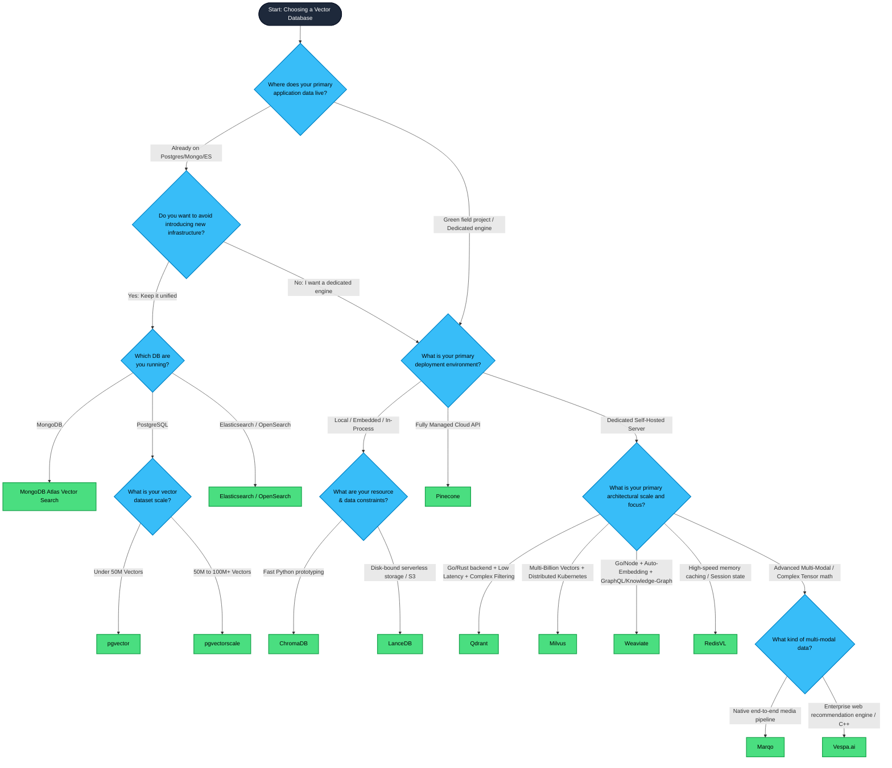

# OmniRAG 🚀

**OmniRAG** is a high-performance, enterprise-grade Retrieval-Augmented Generation (RAG) engine written in Go. 

Unlike standard out-of-the-box RAG setups that fall apart on real-world data, OmniRAG is built to work *on top of existing data* without forcing database schema migrations, intrusive backend re-indexing, or requiring end-users to master complex prompt engineering. It handles localized short keyword searches and abstract semantic queries with equal precision by shifting retrieval intelligence entirely to the orchestration layer.

---

## 🏗️ Core Architecture

OmniRAG isolates the database layer from the AI retrieval logic. It treats your primary database (MongoDB in the current implementations) as the source of truth, while using document-aware routing and conditional fallback mechanisms inside the vector layer (ChromaDB or Qdrant) to improve deterministic accuracy.

The current vector-backed implementations live in `chromadb-rag/` and `Qdrant-rag/`. Both seed MongoDB with source policy content, ingest that content into a vector store with Ollama-generated embeddings, and serve a retrieval UI/API before sending the final context to Claude 3.5 Sonnet or local Ollama Gemma 4 e2b. The Chroma service applies keyword-sensitive `where_document` filtering; the Qdrant service applies payload text filtering against the `content` field and falls back to semantic vector search.

```text
┌──────────────────────────────────────────────────────────────────────────────────────────────┐
│                                        OmniRAG DFD                                           │
│          Go orchestration over MongoDB source data, ChromaDB retrieval, and LLM generation   │
└──────────────────────────────────────────────────────────────────────────────────────────────┘

┌──────────────────────────────────────────────────────────────────────────────────────────────┐
│  1. Ingestion / Input Layer                                                                  │
├──────────────────────────────────────────────────────────────────────────────────────────────┤
│                                                                                              │
│  Source data path                                                                            │
│                                                                                              │
│  ┌──────────────────────────────┐        ┌──────────────────────────────────────────────┐    │
│  │ chromadb-rag/seed/main.go    │        │ MongoDB Source of Truth                      │    │
│  │                              │        │                                              │    │
│  │ - Connects via MONGO_URI     │───────▶│ Database: content_db                         │    │
│  │ - Drops demo collection      │        │ Collection: articles_v2                      │    │
│  │ - Inserts policy documents   │        │ Document field: content                      │    │
│  └──────────────────────────────┘        └──────────────────┬───────────────────────────┘    │
│                                                             │                                │
│                                                             │ Find all source articles        │
│                                                             ▼                                │
│  ┌──────────────────────────────┐        ┌──────────────────────────────────────────────┐    │
│  │ chromadb-rag/ingest/main.go  │        │ Ollama Embedding Service                     │    │
│  │                              │        │ http://localhost:11434                       │    │
│  │ - Reads MongoDB articles     │───────▶│ POST /api/embeddings                         │    │
│  │ - Embeds article content     │        │ model: nomic-embed-text                      │    │
│  │ - Creates Chroma database    │◀───────│ payload: { "prompt": article.content }       │    │
│  │ - Creates policies_v2 index  │        └──────────────────────────────────────────────┘    │
│  └──────────────┬───────────────┘                                                            │
│                 │                                                                            │
│                 │ Add ids, documents, embeddings                                             │
│                 ▼                                                                            │
│  ┌──────────────────────────────────────────────────────────────────────────────────────┐    │
│  │ ChromaDB Vector Store                                                                │    │
│  │ http://localhost:8000                                                                │    │
│  │                                                                                      │    │
│  │ API v2 tenant/database: default/default                                              │    │
│  │ Collection: policies_v2                                                              │    │
│  │ Collection metadata: { "hnsw:space": "cosine" }                                      │    │
│  └──────────────────────────────────────────────────────────────────────────────────────┘    │
│                                                                                              │
│  Runtime query path                                                                           │
│                                                                                              │
│  ┌──────────────────────────────┐        ┌──────────────────────────────────────────────┐    │
│  │ Browser Search UI            │        │ Direct API Client                            │    │
│  │ chromadb-rag/retrieve/static │        │ curl, service, script, or integration        │    │
│  └──────────────┬───────────────┘        └──────────────────┬───────────────────────────┘    │
│                 │                                           │                                │
│                 └───────────────────────┬───────────────────┘                                │
│                                         ▼                                                    │
│                         POST /api/query                                                       │
│                         { "query": "...", "format": "prose|table|json" }                     │
└─────────────────────────────────────────┬────────────────────────────────────────────────────┘
                                          │
                                          ▼
┌──────────────────────────────────────────────────────────────────────────────────────────────┐
│  2. Orchestration / Router Layer                                                             │
├──────────────────────────────────────────────────────────────────────────────────────────────┤
│                                                                                              │
│  ┌──────────────────────────────────────────────────────────────────────────────────────┐    │
│  │ chromadb-rag/retrieve/main.go                                                       │    │
│  │ HTTP server: http://localhost:8080                                                   │    │
│  │                                                                                      │    │
│  │ Routes implemented:                                                                  │    │
│  │ - GET  /                         static web UI                                       │    │
│  │ - POST /api/query                retrieval + generation endpoint                     │    │
│  │ - OPTIONS /api/query             CORS preflight                                      │    │
│  │                                                                                      │    │
│  │ Current query orchestration:                                                         │    │
│  │ - Parse JSON request                                                                 │    │
│  │ - Embed query with Ollama /api/embed                                                 │    │
│  │ - Prefix query text as "search_query: ..."                                           │    │
│  │ - Query ChromaDB collection policies_v2                                              │    │
│  │ - Apply where_document only for single-token short queries                           │    │
│  │ - Retry without where_document when filtered search returns zero documents            │    │
│  │ - Merge up to 2 Chroma results into one context block                                │    │
│  │ - Build a grounded prompt with the requested output format                           │    │
│  │ - Route generation to Claude or Ollama                                               │    │
│  └──────────────────────────────────────────────────────────────────────────────────────┘    │
│                                                                                              │
│  Query routing behavior                                                                       │
│                                                                                              │
│  ┌──────────────────────────────────────────────┐      ┌─────────────────────────────────┐   │
│  │ Short Keyword Query                          │      │ Complex Phrase Query             │   │
│  │ Example: "health"                            │      │ Example: "working remotely"      │   │
│  │                                              │      │                                  │   │
│  │ Detection: trimmed query has no spaces       │      │ Detection: trimmed query has     │   │
│  │                                              │      │ one or more spaces               │   │
│  │ Chroma payload adds:                         │      │                                  │   │
│  │ where_document: { "$contains": rawQuery }    │      │ Chroma payload uses raw vector    │   │
│  │                                              │      │ search with no document filter    │   │
│  └──────────────────┬───────────────────────────┘      └────────────────┬────────────────┘   │
│                     │                                                     │                    │
│                     └──────────────────────┬──────────────────────────────┘                    │
│                                            ▼                                                   │
│                           Dynamic fallback: retry semantic search if                           │
│                           the short-keyword document filter returns no hits                     │
└────────────────────────────────────────────┬───────────────────────────────────────────────────┘
                                             │
                                             ▼
┌──────────────────────────────────────────────────────────────────────────────────────────────┐
│  3. Database / Retrieval Layer                                                               │
├──────────────────────────────────────────────────────────────────────────────────────────────┤
│                                                                                              │
│  ┌──────────────────────────────────────────────┐      ┌─────────────────────────────────┐   │
│  │ MongoDB                                      │      │ ChromaDB                         │   │
│  │ Source of Truth                              │      │ Vector Retrieval Store           │   │
│  │                                              │      │                                  │   │
│  │ Used by: seed/main.go, ingest/main.go        │      │ Used by: ingest/main.go,          │   │
│  │ Database: content_db                         │      │ retrieve/main.go                 │   │
│  │ Collection: articles_v2                      │      │ Collection: policies_v2           │   │
│  │                                              │      │                                  │   │
│  │ Owns canonical source text for ingestion.    │      │ Stores document text plus vectors │   │
│  │ Retrieval does not query MongoDB at runtime. │      │ and returns up to 2 candidates.   │   │
│  └──────────────────────────────────────────────┘      └─────────────────────────────────┘   │
│                                                                                              │
│  Chroma query payloads                                                                        │
│                                                                                              │
│  Short keyword:                                                                               │
│  { "query_embeddings": [[...]], "n_results": 2, "where_document": { "$contains": "health" } } │
│                                                                                              │
│  Complex phrase or fallback:                                                                  │
│  { "query_embeddings": [[...]], "n_results": 2 }                                              │
└────────────────────────────────────────────┬─────────────────────────────────────────────────┘
                                             │
                                             ▼
┌──────────────────────────────────────────────────────────────────────────────────────────────┐
│  4. LLM Generation Layer                                                                     │
├──────────────────────────────────────────────────────────────────────────────────────────────┤
│                                                                                              │
│  ┌──────────────────────────────────────────────────────────────────────────────────────┐    │
│  │ Prompt Assembly                                                                      │    │
│  │                                                                                      │    │
│  │ "You are a precise corporate assistant. Answer the query based ONLY on the provided   │    │
│  │ context retrieved from our database. If you cannot answer it, say                    │    │
│  │ I cannot answer this based on the provided information."                             │    │
│  │                                                                                      │    │
│  │ Format Requirement: prose | Markdown table | JSON object                             │    │
│  │ Context: combined Chroma documents                                                   │    │
│  │ Query: original user query                                                           │    │
│  └──────────────────────────────────────────────────────────────────────────────────────┘    │
│                                                                                              │
│  ┌──────────────────────────────────────────────┐      ┌─────────────────────────────────┐   │
│  │ Anthropic Claude Client                      │      │ Ollama Local Client              │   │
│  │                                              │      │                                  │   │
│  │ Used when ANTHROPIC_API_KEY is set           │      │ Used when ANTHROPIC_API_KEY      │   │
│  │ Model: claude-3-5-sonnet-20241022            │      │ is not set                       │   │
│  │ Endpoint: https://api.anthropic.com/v1       │      │ Model: gemma4:e2b                │   │
│  │ max_tokens: 1024                             │      │ Endpoint: /api/generate          │   │
│  └──────────────────┬───────────────────────────┘      └────────────────┬────────────────┘   │
│                     │                                                     │                    │
│                     └──────────────────────┬──────────────────────────────┘                    │
│                                            ▼                                                   │
│                           ┌──────────────────────────────────────────────┐                     │
│                           │ JSON API Response                            │                     │
│                           │                                              │                     │
│                           │ - answer                                     │                     │
│                           │ - source                                     │                     │
│                           │ - score                                      │                     │
│                           │ - generator                                  │                     │
│                           └──────────────────────────────────────────────┘                     │
└──────────────────────────────────────────────────────────────────────────────────────────────┘
```

### Key Engineering Features:
* **Zero-Data Alteration:** Works directly on raw, unpadded enterprise text segments.
* **Deterministic Keyword Protection:** Uses vector-store document/payload pre-filtering (`where_document` in ChromaDB, payload text filters in Qdrant) to reduce embedding drift on short-tail keywords.
* **Dynamic Failure Fallback:** Automatically drops strict constraints and shifts to pure semantic vector math if zero string matches are found—ensuring high recall.
* **Go Backend Performance:** Lightweight, direct HTTP services with a small orchestration surface.

---

## 🛠️ Tech Stack

* **Language:** Go (Golang)
* **Primary Store:** MongoDB (Source of Truth)
* **Vector Databases:** ChromaDB and Qdrant
* **Embeddings Model:** `nomic-embed-text` (via Ollama)
* **Generation Models:** Claude 3.5 Sonnet / Gemma 4 e2b
* **Current ChromaDB Implementation:** `chromadb-rag/`
* **Current Qdrant Implementation:** `Qdrant-rag/`
* **Legacy Prototype:** `mongo-rag-beginner/`

---

## 🚦 Getting Started & Installation

If you do not have the required database, vector, or model dependencies installed, please follow these detailed steps to set up your environment:

### 1. Prerequisites & Installation

#### A. Install Go (Golang)
Go is required to run and build the microservices.
- **Mac (Homebrew)**:
  ```bash
  brew install go
  ```
- **Manual Install**: Download from [golang.org/dl](https://golang.org/dl/) and run the installer.
- **Confirm**: Verify in your terminal with `go version`.

#### B. Install & Start MongoDB
MongoDB is used as the transactional content store.
- **Mac (Homebrew)**:
  1. Add the MongoDB tap:
     ```bash
     brew tap mongodb/brew
     ```
  2. Install the Community Server:
     ```bash
     brew install mongodb-community@6.0
     ```
  3. Start it as a background service:
     ```bash
     brew services start mongodb-community@6.0
     ```
- **Docker Fallback**:
  ```bash
  docker run -d -p 27017:27017 --name mongodb mongo:latest
  ```

#### C. Install & Start ChromaDB
ChromaDB is one supported vector search index.
- **Install Docker (If missing)**: Download Docker Desktop from [docker.com](https://www.docker.com/products/docker-desktop/).
- **Start ChromaDB Container (Recommended)**:
  ```bash
  docker run -d -p 8000:8000 --name chromadb chromadb/chroma:latest
  ```
- **Python Alternative**:
  ```bash
  pip install chromadb
  chroma run --host localhost --port 8000
  ```

#### D. Install & Start Qdrant
Qdrant is the second supported vector search index.
- **Start Qdrant Container (Recommended)**:
  ```bash
  docker run -d -p 6333:6333 -p 6334:6334 --name qdrant qdrant/qdrant:latest
  ```

#### E. Install & Configure Ollama (Local Embeddings & LLM)
1. Download Ollama for your OS from [ollama.com](https://ollama.com).
2. Launch the Ollama app (confirm the status agent is active in your system menu bar).
3. Open a terminal and pull the models:
   ```bash
   # Pull the local embedding model
   ollama pull nomic-embed-text
   
   # Pull the local generation model
   ollama pull gemma4:e2b
   ```

#### F. Configure Claude (Anthropic API Key)
For premium cloud response formatting:
1. Sign up at [console.anthropic.com](https://console.anthropic.com/).
2. Go to **API Keys** and generate a new key.
3. Export the key in your terminal before launching the retrieval server:
   ```bash
   export ANTHROPIC_API_KEY="your-anthropic-api-key"
   ```

### 2. Environment Configurations

Below are the default connection coordinates used by the Go stack:
```text
MongoDB URI:  mongodb://localhost:27017 (unless MONGO_URI is set)
ChromaDB:     http://localhost:8000
Qdrant:       http://localhost:6333
Ollama:       http://localhost:11434
Server Host:  http://localhost:8080
```

### 3. Run the Engine

Choose one vector-backed implementation.

#### ChromaDB service

```bash
# From the repository root
cd chromadb-rag

# Seed MongoDB source content
go run seed/main.go

# Ingest MongoDB content into ChromaDB
go run ingest/main.go

# Start the retrieval web server and API
go run retrieve/main.go
```

#### Qdrant service

```bash
# From the repository root
cd Qdrant-rag

# Seed MongoDB source content
go run seed/main.go

# Ingest MongoDB content into Qdrant
go run ingest/main.go

# Start the retrieval web server and API
go run retrieve/main.go
```

The retrieval web server will launch immediately on `http://localhost:8080`.

---

## 🔌 API Usage

### POST `/api/query`

Runs query embedding, vector retrieval, prompt construction, and LLM generation. Both `chromadb-rag/` and `Qdrant-rag/` expose the same request and response shape.

Request body:

```json
{
  "query": "health",
  "format": "prose"
}
```

Supported `format` values:

```text
prose
table
json
```

Example:

```bash
curl -X POST http://localhost:8080/api/query \
  -H "Content-Type: application/json" \
  -d '{
    "query": "health",
    "format": "prose"
  }'
```

Response shape:

```json
{
  "answer": "Health insurance benefits are fully covered for all permanent full-time employees beginning on their first day of employment.",
  "source": "- Comprehensive Healthcare and Medical Benefits Package: Group health insurance benefits, including dental and vision insurance coverage, are fully paid and covered for all permanent full-time employees, beginning immediately on their official first day of employment.\n",
  "score": 0.9281,
  "generator": "Claude 3.5 Sonnet"
}
```

If `ANTHROPIC_API_KEY` is not set, `generator` is returned as:

```text
Ollama (Gemma 4 e2b)
```

> [!TIP]
> **Model Customization**: You can customize or change the local Ollama model (e.g. using `gemma4:e2b`, `llama3`, `mistral`, or others) inside the Go configuration based entirely on your system specifications, GPU capabilities, RAM, and operational requirements. Lightweight models (e.g. 2B to 8B parameter variants) are recommended for general laptops, while larger models (e.g. 13B+ parameters) are perfect for setups equipped with dedicated Apple Silicon unified memory or high-end graphics cards.

### CORS

`OPTIONS /api/query` is supported for browser preflight requests. The handler sets:

```text
Access-Control-Allow-Origin: *
Access-Control-Allow-Headers: Content-Type
Access-Control-Allow-Methods: POST, OPTIONS
```

### Health Checks and CLI Flags

The current code does not implement a dedicated `GET /health` endpoint or CLI flags. Runtime values such as ChromaDB/Qdrant URL, Ollama URL, model names, and server port are currently hard-coded in the Go files.

---

## 📂 Recommended Directory Structure

The current repository structure is:

```text
Omni-RAG/
├── README.md
├── README_v2.md
├── LICENSE
├── chromadb-rag/
│   ├── README.md
│   ├── go.mod
│   ├── go.sum
│   ├── seed/
│   │   └── main.go
│   ├── ingest/
│   │   └── main.go
│   └── retrieve/
│       ├── main.go
│       └── static/
│           ├── app.js
│           ├── index.html
│           └── style.css
├── Qdrant-rag/
│   ├── README.md
│   ├── go.mod
│   ├── go.sum
│   ├── seed/
│   │   └── main.go
│   ├── ingest/
│   │   └── main.go
│   └── retrieve/
│       ├── main.go
│       └── static/
│           ├── app.js
│           ├── index.html
│           └── style.css
└── mongo-rag-beginner/
    ├── README.md
    ├── go.mod
    ├── go.sum
    ├── ingest/
    │   └── main.go
    └── retrieve/
        ├── main.go
        └── static/
            ├── app.js
            ├── index.html
            └── style.css
```

`chromadb-rag/` is the ChromaDB-backed OmniRAG implementation. `Qdrant-rag/` is the Qdrant-backed implementation with payload text filtering and semantic fallback. `mongo-rag-beginner/` is an earlier MongoDB-only prototype that stores embeddings directly in MongoDB and performs an in-process dot-product scan.

---

##
# 🌐 The Master Vector Database Decision Matrix

### 1. Dedicated Native Vector Engines
*Databases engineered from scratch solely for high-concurrency vector math and multi-dimensional geometric index graphs (HNSW, Vamana).*

| Database | Under-The-Hood Engine | The Superpower | Usage Criteria / When to Use | The Catch (Cons) | Why Use / Why Switch to It |
| :--- | :--- | :--- | :--- | :--- | :--- |
| **Qdrant** | **Rust**<br>Custom memory-mapped ($mmap$) files for HNSW graphs. | **In-Graph Filtering**<br>Applies complex boolean and metadata checks *during* vector graph traversal, protecting p99 latency (~12ms). | High-concurrency applications, real-time AI agents, and systems under 100M vectors requiring intense metadata filtering. | Smaller community-driven plugin ecosystem compared to PostgreSQL or Milvus. | **Switch when:** Your current database's vector extensions fail or hit a latency wall under concurrent queries, or you need clean, native Go gRPC support. |
| **Milvus** | **Go / C++ / Python**<br>Distributed Kubernetes sharding layer. Decouples proxy, storage, and worker nodes. | **Multi-Billion Scaling**<br>Capable of horizontal scaling to tens of billions of vectors. Supports native GPU-accelerated graph rebuilding. | Enterprise-grade AI infrastructure, multi-modal data lakes (video/audio processing), and massive corporate internal datasets. | Extreme infrastructure overhead. Running a full cluster locally requires significant CPU, RAM, and DevOps tuning. | **Switch when:** Your vector dataset grows beyond 100M+ items and a single-node database box can no longer store or index your vectors in RAM. |
| **Pinecone** | **Proprietary Rust Engine**<br>Closed-source, fully managed, globally available serverless system. | **Zero-Ops Serverless**<br>Completely hands-off infrastructure management. You get a raw API endpoint that scales compute and storage automatically. | Small engineering squads, rapid product launches, or teams that strictly refuse to maintain self-hosted cloud data infra. | Hard cloud vendor lock-in. No local or offline operation modes. Usage-based premium pricing can scale aggressively. | **Switch when:** You want to offload 100% of your vector database maintenance, patching, scaling, and operational monitoring to an external cloud vendor. |
| **Weaviate** | **Go**<br>Combines a custom inverted index vector graph with an object schema database. | **Auto-Vectorization**<br>Accepts raw data objects directly; hooks into embedding models (Ollama, Hugging Face) to generate vectors inside the DB automatically. | Graph-centric knowledge pipelines, highly structured semantic searches, or teams who want the DB to handle the embedding loop. | High memory footprint; slightly higher p99 search latency profiles compared to low-level Rust engines like Qdrant. | **Switch when:** You are writing an application in Go or Node and want an object-oriented vector store that automates your data chunk embedding workflows natively. |

---

### 2. Traditional Database Extensions
*Production-proven relational, document, or analytical engines that patched in vector distance indexing layers to eliminate data pipeline clutter.*

| Database | Under-The-Hood Engine | The Superpower | Usage Criteria / When to Use | The Catch (Cons) | Why Use / Why Switch to It |
| :--- | :--- | :--- | :--- | :--- | :--- |
| **MongoDB Atlas** | **C++ / Java Core**<br>Isolated HNSW vector search indexes layered directly inside standard transactional collections. | **Zero Data Sprawl**<br>Maintains raw application documents, nested metadata, and vector arrays inside a single collection. | Production applications already utilizing MongoDB as their core primary transactional source of truth. | Vector features are heavily coupled to MongoDB Atlas cloud infrastructure rather than open-source community deployments. | **Switch when:** You want to instantly add semantic search or basic RAG capabilities to your app without introducing a completely new database system. |
| **pgvector** *(Postgres)* | **C**<br>Adds native `vector` data types with HNSW or IVFFlat indexing directly inside PostgreSQL relational tables. | **Unified SQL Relational Joins**<br>Allows you to execute vector distance scoring alongside standard relational `JOIN` conditions and ACID transactions. | Teams running a PostgreSQL architecture where the vector dataset fits comfortably inside the server's available RAM. | High concurrent vector search queries can saturate server CPU/RAM, slowing down your primary transactional database tables. | **Switch when:** You need strict relational consistency and want to manage standard user tables and vector fields together with clean, basic SQL query structures. |
| **pgvectorscale** | **Rust (PGRX)**<br>An extension layer built on top of pgvector that adds Microsoft’s **StreamingDiskANN** algorithm. | **Disk-Bounded Graph Search**<br>Compresses indices using Statistical Binary Quantization (SBQ), storing full graphs on disk instead of expensive RAM. | High-volume Postgres vector pipelines (10M to 100M+ vectors) where hosting the whole HNSW graph in system RAM is too expensive. | Must be layered precisely over an existing pgvector environment; relaxed ordering can sometimes return slightly out-of-order logs. | **Switch when:** Your Postgres `pgvector` HNSW index is exhausting your system RAM capacity, causing your infrastructure costs to skyrocket. |
| **Elasticsearch / OpenSearch** | **Java (Apache Lucene Core)**<br>Enterprise text indexing engine updated with approximate nearest neighbor (ANN) math. | **True Hybrid Search**<br>Seamlessly merges classic BM25 keyword lexical ranking with dense semantic vectors into a unified relevance score. | Systems requiring precision-focused keyword text search (SKUs, logs, legal text) layered with semantic fallback mechanisms. | Heavy, resource-intensive JVM memory configuration footprints. Pure vector query latency lags behind native engines. | **Switch when:** Your users demand advanced keyword features (like fuzzy spelling correction or regex filtering) blended with semantic vector matching. |

---

### 3. In-Memory & Embedded Stores
*Serverless or in-process database engines that execute vector lookups directly inside your application code memory space or against local static files.*

| Database | Under-The-Hood Engine | The Superpower | Usage Criteria / When to Use | The Catch (Cons) | Why Use / Why Switch to It |
| :--- | :--- | :--- | :--- | :--- | :--- |
| **ChromaDB** | **Python / ClickHouse Core**<br>In-process engine or single-point client-server running local collections. | **Frictionless DX**<br>Extremely low developer friction. You can initialize an application, embed text, and query vectors locally in under 10 lines of code. | Rapid prototyping, validation phases, internal proof-of-concept RAG scripting, and smaller localized app deployments. | Does not natively scale horizontally across distributed container nodes without custom backend architecture engineering. | **Switch when:** You are in the early R&D phase of an application and want a simple vector database that works instantly without infrastructure overhead. |
| **LanceDB** | **Rust / Lance Columnar Format**<br>Serverless architecture mapping vectors directly onto local files or cloud storage buckets (AWS S3). | **Disk-Native Execution**<br>Queries immense vector graphs directly from disk without needing to preload your entire database index into RAM cache. | Local multi-modal apps (storing image/video arrays locally), edge compute devices, or building cost-effective serverless big data tools. | Random write and point-update performance is slower due to its disk-bound, append-only columnar layout mechanics. | **Switch when:** You want to store and search millions of high-dimensional vectors on serverless infrastructure (like AWS Lambda) using low-cost disk volumes. |

---

### 4. In-Memory Cache Layers
*Volatile, memory-first key-value structures optimized to provide instant vector lookups at the expense of heavy disk persistence.*

| Database | Under-The-Hood Engine | The Superpower | Usage Criteria / When to Use | The Catch (Cons) | Why Use / Why Switch to It |
| :--- | :--- | :--- | :--- | :--- | :--- |
| **RedisVL** | **C**<br>Vector indexing framework implemented directly over Redis's optimized in-memory data arrays. | **Sub-Millisecond Speeds**<br>Delivers faster raw response times than nearly any disk-bound system by running entirely within system RAM cache. | LLM conversational history tracking, session memory management for autonomous AI agents, and high-frequency semantic caching. | Extremely expensive to scale linearly because your storage capacity is completely bound by the physical RAM limits of the system. | **Switch when:** You need a high-speed caching layer to intercept repetitive semantic questions before they hit your slower primary vector database. |

---

### 5. Multi-Modal Tensor Engines
*Advanced multi-layer execution platforms built to process complex, multi-dimensional tensors rather than simple, flat vector arrays.*

| Database | Under-The-Hood Engine | The Superpower | Usage Criteria / When to Use | The Catch (Cons) | Why Use / Why Switch to It |
| :--- | :--- | :--- | :--- | :--- | :--- |
| **Vespa.ai** | **C++**<br>Advanced real-time computation engine designed to execute heavy mathematical calculations over distributed nodes. | **Native Tensor Math**<br>Evaluates complex machine-learned ranking tables and multi-layered tensors directly inside the storage nodes, bypassing the network. | Large-scale production web recommendation feeds, ad-targeting networks, and enterprise apps merging vectors with deep ranking logic. | Exceptionally high learning curve and custom configuration architecture requirements compared to standard SQL or NoSQL stores. | **Switch when:** You have outgrown basic vector similarity (cosine distance) and need a system that evaluates complex machine learning models directly inside the database. |
| **Marqo** | **Python / C++ Core**<br>AI-native search platform pairing internal embedding model lifecycles directly with vector data storage. | **End-to-End Multi-Modality**<br>You feed it raw text or images; its internal processing layer automatically aligns and generates matching multi-modal vectors. | Complex multi-modal setups (like matching an incoming text query to un-tagged image frames or audio clips) without external pipelines. | Heavy resource footprint due to managing data storage alongside active multi-modal transformer inference models. | **Switch when:** You want a single database ecosystem to ingest raw documents and media assets directly without writing separate custom embedding extraction workers. |

---

## Decision Tree (Vector DB)



## 🗺️ Engineering Roadmap

OmniRAG is actively evolving from a single-node retrieval pipeline into a highly distributed, multi-agent framework.

* [x] **v1.0.0 (Current):** Go + ChromaDB metadata optimization layer, fixing short-query vector bias.
* [ ] **v1.1.0:** Abstracted multi-vector DB client interface supporting **Qdrant** and **Milvus**.
* [ ] **v1.2.0:** Horizontally scalable ingestion worker pools for heavy concurrent document parsing.
* [ ] **v2.0.0:** Integration of **LangChain** and **LangGraph** for autonomous, stateful multi-agent workflows and graph-based context retrieval.

---

## 📄 License

Distributed under the MIT License. See `LICENSE` for more information.
