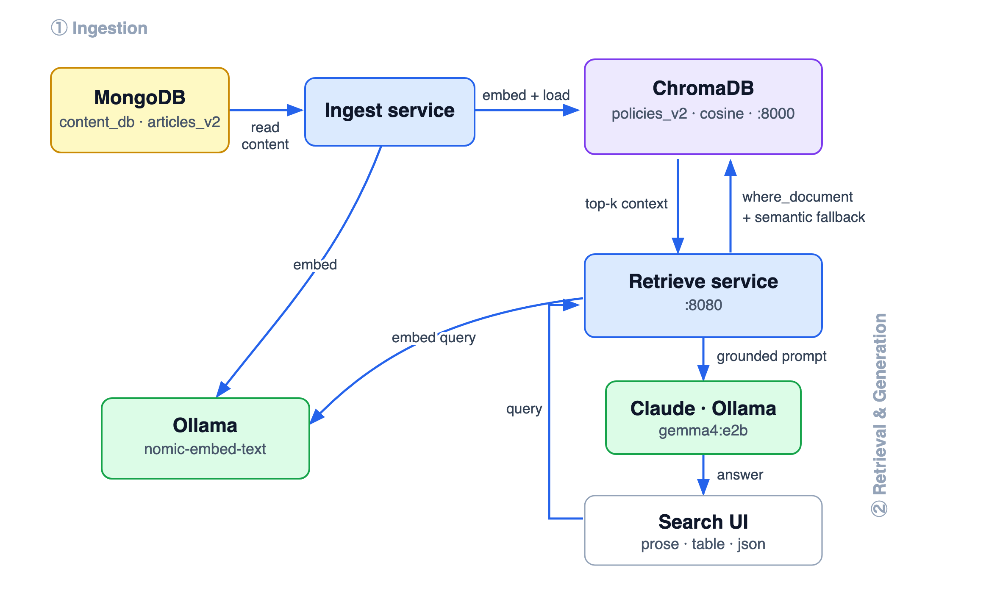

# 🚀 Enterprise Go RAG Stack: MongoDB Content, ChromaDB Vectors & Web UI

A highly decoupled, professional microservices RAG (Retrieval-Augmented Generation) pipeline written in Go. This architecture separates primary content transactional storage from specialized vector search, utilizing **MongoDB** as the raw document database, **ChromaDB** as the high-dimensional vector search index, and **Ollama** or **Claude** for AI response generation.

---

## 📊 Visual Data Flow Diagram (DFD)

<p align="center">
  
</p>

---

## 🔄 Execution Flow

1. **Seeding Phase**: The Content Seeder connects to MongoDB and seeds raw, plain-text policy documents.
2. **Ingestion Phase**: The Ingestion Service reads those raw text entries from MongoDB, passes each document to Ollama's local embeddings API to generate a high-dimensional vector, and loads both the raw text and vector into ChromaDB.
3. **Retrieval Phase**: The Retrieval HTTP Server serves the static dashboard at `localhost:8080`. When a query comes in:
   - It embeds the query text using Ollama.
   - It executes a vector similarity search directly in ChromaDB.
   - It constructs an augmented prompt using the retrieved context and formatting requirements (Prose, Table, JSON).
   - It executes the LLM (Claude or offline `gemma4:e2b`) and streams the formatted response back to the visual frontend.

---

## 🛠️ Stack Specifications & Models

| Component | Technology | Model / Version | Purpose |
| :--- | :--- | :--- | :--- |
| **Content DB** | MongoDB | Community Server (v6.0+) | Primary content & operational transactional storage. |
| **Vector DB** | ChromaDB | Docker or Local (v0.4+) | Fast, high-dimensional vector similarity index. |
| **Orchestration** | Go | v1.21+ | High-speed, decoupled microservices. |
| **Embedder** | Ollama | `nomic-embed-text` | Generates 768-dimensional local text embeddings. |
| **Local LLM** | Ollama | `gemma4:e2b` | Offline generation and formatting fallback. |
| **Cloud LLM** | Anthropic | `claude-3-5-sonnet-20241022` | Cloud generation and precise format structuring. |

---

## 📋 Prerequisites & Installation Instructions

If you do not have these dependencies installed, please follow the steps below to set up your environment:

### 1. Install Go (Golang)
Go is required to compile and execute the microservices.
- **Mac (Homebrew)**:
  ```bash
  brew install go
  ```
- **Manual**: Download the package installer from [golang.org/dl](https://golang.org/dl/) and install.
- **Verify**: Open a terminal and run `go version` to confirm a successful installation.

### 2. Install & Start MongoDB
MongoDB is used to store raw text documents before they are embedded.
- **Mac (Homebrew)**:
  1. Register the MongoDB tap:
     ```bash
     brew tap mongodb/brew
     ```
  2. Install MongoDB Community Edition:
     ```bash
     brew install mongodb-community@6.0
     ```
  3. Start MongoDB as a macOS background service:
     ```bash
     brew services start mongodb-community@6.0
     ```
- **Docker fallback** (if you prefer Docker instead of local Homebrew):
  ```bash
  docker run -d -p 27017:27017 --name mongodb mongo:latest
  ```

### 3. Install & Start ChromaDB
ChromaDB is our vector index database. The easiest way to run it is via Docker or Python.
- **Install Docker (If not installed)**:
  Download Docker Desktop for Mac from [docker.com](https://www.docker.com/products/docker-desktop/) and start the application.
- **Start ChromaDB via Docker (Recommended)**:
  ```bash
  docker run -d -p 8000:8000 --name chromadb chromadb/chroma:latest
  ```
- **Alternative (Python-based Local Install)**:
  ```bash
  pip install chromadb
  chroma run --host localhost --port 8000
  ```

### 4. Install & Configure Ollama (Local Embedding & LLM)
Ollama allows us to generate embeddings and run LLM inference locally.
1. Download Ollama for Mac/Linux/Windows from [ollama.com](https://ollama.com).
2. Install and launch the Ollama application (it runs a local agent in your menu bar).
3. Open a terminal and download the required models:
   ```bash
   # 1. Download the specialized embedding model
   ollama pull nomic-embed-text
   
   # 2. Download the local generation LLM
   ollama pull gemma4:e2b
   ```
4. Keep the Ollama application running in the background.

> [!TIP]
> **Ollama Model Selection & Hardware Spec Guidelines**:
> You can choose and run any local Ollama model (such as `gemma4:e2b`, `llama3`, `mistral`, etc.) by changing the `"model"` name string parameter in the Go code.
> - **Lightweight / Basic Laptops (8GB - 16GB RAM / Apple M1/M2/M3 base, or CPU only)**: Recommended to use smaller parameter models like `gemma4:e2b` (highly efficient and optimized), `llama3:8b`, or `phi3`.
> - **High-End Hardware / Dedicated GPUs (16GB+ VRAM, Apple Pro/Max chips with 32GB+ Unified Memory)**: Perfect for running larger, more reasoning-heavy models locally, such as `llama3:70b`, `mixtral:8x7b`, or `command-r`.

### 5. Configure Claude (Anthropic API Key)
To use premium cloud-based response generation:
1. Create an Anthropic Console account at [console.anthropic.com](https://console.anthropic.com/).
2. Navigate to **API Keys** and generate a new API key.
3. Add funds/credits to your account to active key access.
4. Export the key in your terminal before starting the retrieval server (see Step 4 below).

---

## 🚀 How to Run the RAG Pipeline

Follow these steps to execute your complete microservice pipeline:

### Step 1: Initialize Go Dependencies
Navigate into the workspace and tidy the Go modules to resolve driver connections:
```bash
cd /Users/dharmendra/golang-projects/Omni-RAG/chromadb-rag
go mod tidy
```

### Step 2: Seed MongoDB Content
Populate MongoDB (`content_db.articles`) with raw policy articles:
```bash
go run seed/main.go
```
*Expected Output:* `Seeding complete! Populated MongoDB content_db.articles with raw text entries.`

### Step 3: Run Ingestion to ChromaDB
Extract texts from MongoDB, generate vectors via Ollama, and index them inside ChromaDB:
```bash
go run ingest/main.go
```
*Expected Output:* `Ingestion completed! Stored MongoDB content embeddings successfully inside ChromaDB.`

### Step 4: Start the Retrieval Server
Launch the retrieval HTTP engine:
- **To run completely OFFLINE (using local Ollama `gemma4:e2b`)**:
  ```bash
  go run retrieve/main.go
  ```
- **To run in CLOUD mode (using Claude 3.5 Sonnet)**:
  ```bash
  export ANTHROPIC_API_KEY="your-actual-anthropic-api-key"
  go run retrieve/main.go
  ```

*Expected Output:* `Retrieval Web Server listening on http://localhost:8080`

### Step 5: Query via Search Engine UI
1. Open your browser and navigate to **`http://localhost:8080`**.
2. Type a query like `"working remotely"` or `"health benefits"`.
3. Choose your output style: **Human Prose**, **Markdown Table**, or **Structured JSON**.
4. Press Enter or click **Search** and see the augmented response!
