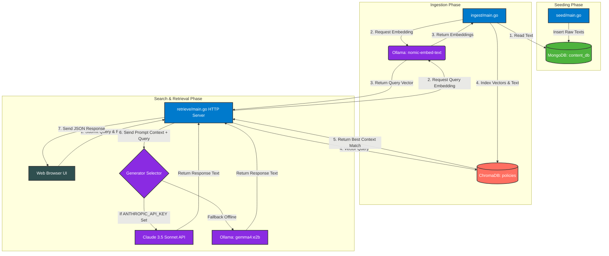

# 🚀 Enterprise Go RAG Stack: MongoDB Content, ChromaDB Vectors & Web UI

A highly decoupled, professional microservices RAG (Retrieval-Augmented Generation) pipeline written in Go. This architecture separates primary content transactional storage from specialized vector search, utilizing **MongoDB** as the raw document database, **ChromaDB** as the high-dimensional vector search index, and **Ollama** or **Claude** for AI response generation.

---

## 📊 Visual Data Flow Diagram (DFD)



---

## 🔄 Execution Flow

1. **Seeding Phase**: The Content Seeder connects to MongoDB and seeds raw, plain-text policy documents.
2. **Ingestion Phase**: The Ingestion Service reads those raw text entries from MongoDB, passes each document to Ollama's local embeddings API to generate a high-dimensional vector, and loads both the raw text and vector into ChromaDB.
3. **Retrieval Phase**: The Retrieval HTTP Server serves the static dashboard at `localhost:8080`. When a query comes in:
   - It embeds the query text using Ollama.
   - It executes a vector similarity search directly in ChromaDB.
   - It constructs an augmented prompt using the retrieved context and formatting requirements (Prose, Table, JSON).
   - It executes the LLM (Claude or offline `gemma4:e2b`) and streams the formatted response back to the visual frontend.

---

## 🛠️ Stack Specifications & Models

| Component | Technology | Model / Version | Purpose |
| :--- | :--- | :--- | :--- |
| **Content DB** | MongoDB | Community Server (v6.0+) | Primary content & operational transactional storage. |
| **Vector DB** | ChromaDB | Docker or Local (v0.4+) | Fast, high-dimensional vector similarity index. |
| **Orchestration** | Go | v1.21+ | High-speed, decoupled microservices. |
| **Embedder** | Ollama | `nomic-embed-text` | Generates 768-dimensional local text embeddings. |
| **Local LLM** | Ollama | `gemma4:e2b` | Offline generation and formatting fallback. |
| **Cloud LLM** | Anthropic | `claude-3-5-sonnet-20241022` | Cloud generation and precise format structuring. |

---

## 📋 Prerequisites & Installation Instructions

If you do not have these dependencies installed, please follow the steps below to set up your environment:

### 1. Install Go (Golang)
- **Mac (Homebrew)**:
  ```bash
  brew install go
  ```
- **Manual**: Download the package installer from [golang.org/dl](https://golang.org/dl/) and install.
- **Verify**: `go version`

### 2. Install & Start MongoDB
- **Mac (Homebrew)**:
  ```bash
  brew tap mongodb/brew
  brew install mongodb-community@6.0
  # Start MongoDB background service
  brew services start mongodb-community@6.0
  ```
- **Docker**:
  ```bash
  docker run -d -p 27017:27017 --name mongodb mongo:latest
  ```

### 3. Install & Start ChromaDB
ChromaDB is most easily run via Docker or Python:
- **Docker (Recommended)**:
  ```bash
  docker run -d -p 8000:8000 --name chromadb chromadb/chroma:latest
  ```
- **Python**:
  ```bash
  pip install chromadb
  chroma run --host localhost --port 8000
  ```

### 4. Install & Configure Ollama
1. Download Ollama for Mac/Linux/Windows from [ollama.com](https://ollama.com).
2. Start the Ollama application.
3. Open your terminal and pull the specialized RAG models:
   ```bash
   # Pull the local embedding model
   ollama pull nomic-embed-text
   
   # Pull your target local generation model
   ollama pull gemma4:e2b
   ```

---

## 🚀 How to Run the RAG Pipeline

Follow these 4 simple steps to execute your complete microservice pipeline:

### Step 1: Initialize Go Dependencies
Navigate into the workspace and tidy the Go modules to resolve driver connections:
```bash
cd /Users/dharmendra/golang-projects/chromadb-rag
go mod tidy
```

### Step 2: Seed MongoDB Content
Populate MongoDB (`content_db.articles`) with raw policy articles:
```bash
go run seed/main.go
```
*Expected Output:* `Seeding complete! Populated MongoDB content_db.articles with raw text entries.`

### Step 3: Run Ingestion to ChromaDB
Extract texts from MongoDB, generate vectors, and register them inside ChromaDB:
```bash
go run ingest/main.go
```
*Expected Output:* `Ingestion completed! Stored MongoDB content embeddings successfully inside ChromaDB.`

### Step 4: Start the Retrieval Server
Launch the retrieval HTTP engine:
- **To run completely OFFLINE (using Ollama `gemma4:e2b`)**:
  ```bash
  go run retrieve/main.go
  ```
- **To run in CLOUD mode (using Claude 3.5 Sonnet)**:
  ```bash
  export ANTHROPIC_API_KEY="your-anthropic-api-key"
  go run retrieve/main.go
  ```

*Expected Output:* `Retrieval Web Server listening on http://localhost:8080`

### Step 5: Query via Search Engine UI
1. Open your browser and navigate to **`http://localhost:8080`**.
2. Type a query like `"working remotely"` or `"health benefits"`.
3. Choose your output style: **Human Prose**, **Markdown Table**, or **Structured JSON**.
4. Press Enter or click **Search** and see the augmented response!
