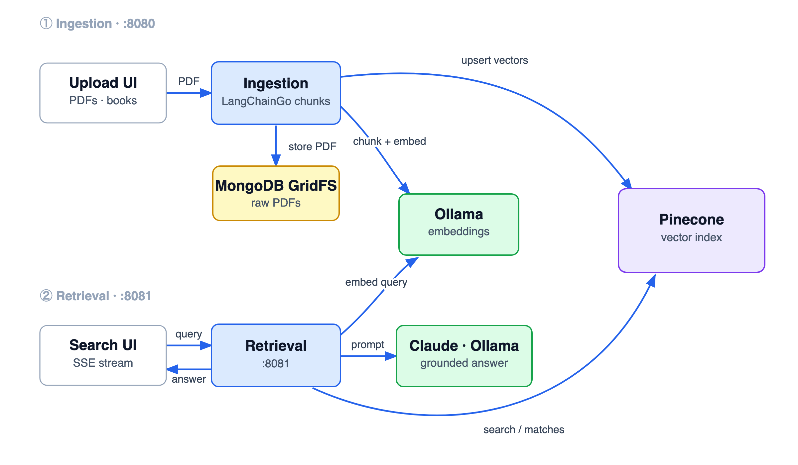

# Pinecone RAG — Ingestion & Retrieval

This module is the Pinecone-backed RAG pipeline for OmniRAG, split into two services:

| Service | Folder | Port | Role |
|---|---|---|---|
| **Ingestion** | `ingestion/` | `8080` | Upload PDFs → GridFS → chunk → embed → upsert to Pinecone |
| **Retrieval** | `retrieval/` | `8081` | Query → embed → Pinecone search → LLM answer (streamed via SSE) |

The **retrieval** service can generate answers with **Anthropic Claude** or fall back to local **Ollama** — see [Retrieval Service](#retrieval-service) below.

<p align="center">
  
</p>

---

## Ingestion Service

This service implements a full-stack PDF ingestion pipeline for OmniRAG. It stores raw PDF files in MongoDB GridFS, extracts text page-by-page, chunks text with LangChainGo, generates local Ollama embeddings, upserts vectors into Pinecone, and streams live progress to a Tailwind-powered dashboard through Server-Sent Events.

## Architecture

```text
Browser Upload UI
    │
    │ POST /api/upload multipart PDF
    ▼
Go Upload Handler
    │
    ├── validates .pdf extension and PDF signature
    ├── streams raw binary into MongoDB GridFS
    └── starts async ingestion job
          │
          ├── reads PDF back from GridFS by ObjectID
          ├── extracts page text with github.com/ledongthuc/pdf
          ├── chunks each page with RecursiveCharacter splitter
          ├── embeds chunks concurrently through Ollama /api/embed
          └── upserts vectors into Pinecone /vectors/upsert

GET /api/events/{job_id} streams live SSE progress to the UI.
```

## Data Traceability

MongoDB GridFS is the raw source of truth. Every vector written to Pinecone includes the GridFS ObjectID in both its vector ID and metadata:

```json
{
  "id": "book_[MONGO_OBJECT_ID]_chunk_[INCREMENTING_INDEX]",
  "values": [0.1, 0.2],
  "metadata": {
    "source_file_id": "[MONGO_OBJECT_ID]",
    "text_content": "[RAW 1000 CHAR CHUNK]",
    "chapter": 1,
    "page_number": 42
  }
}
```

That means a retrieval result from Pinecone can always be traced back to the original PDF binary stored in GridFS.

## Endpoints

### `GET /`

Serves the upload dashboard.

### `POST /api/upload`

Accepts a multipart PDF upload. The form field must be named `file`.

Response:

```json
{
  "job_id": "665a...",
  "file_id": "665b..."
}
```

### `GET /api/events/{job_id}`

Streams Server-Sent Events. Event payloads are JSON objects:

```json
{
  "job_id": "...",
  "stage": 2,
  "status": "processing",
  "message": "Reading Page 14 of 42...",
  "current_page": 14,
  "total_pages": 42,
  "progress": 31
}
```

## Runtime Configuration

| Variable | Default | Description |
|---|---|---|
| `PORT` | `8080` | HTTP server port. |
| `MONGO_URI` | `mongodb://localhost:27017` | MongoDB connection string. |
| `MONGO_DATABASE` | `rag_documents` | Database for GridFS bucket. |
| `GRIDFS_BUCKET` | `pdf_uploads` | GridFS bucket prefix. |
| `OLLAMA_BASE_URL` | `http://localhost:11434` | Local Ollama server. |
| `OLLAMA_EMBED_MODEL` | `gemma4:e2b` | Ollama model used for embeddings. |
| `PINECONE_API_KEY` | unset | Pinecone API key. Required for upsert. |
| `PINECONE_INDEX` | unset | Pinecone index name. Required for host discovery. |
| `PINECONE_HOST` | unset | Pinecone index host. Optional if `PINECONE_INDEX` can be described through SDK. |
| `PINECONE_NAMESPACE` | unset | Optional Pinecone namespace. |
| `EMBED_WORKERS` | `5` | Concurrent embedding worker count. |
| `UPSERT_BATCH_SIZE` | `50` | Pinecone upsert batch size. |
| `MAX_UPLOAD_MB` | `100` | Upload size limit. |

## Prerequisites

Start MongoDB:

```bash
docker run -d -p 27017:27017 --name mongodb mongo:latest
```

Start Ollama and pull the configured model:

```bash
ollama pull gemma4:e2b
```

Set Pinecone configuration:

```bash
export PINECONE_API_KEY="your-key"
export PINECONE_INDEX="your-index"
# Optional if SDK DescribeIndex can resolve the host:
export PINECONE_HOST="https://your-index-host"
```

## Run

```bash
cd /Users/dharmendra/golang-projects/Omni-RAG/pinecone-rag
go mod tidy
go run .
```

Open:

```text
http://localhost:8080
```

## Verification

```bash
gofmt -w main.go
go test ./...
```

## Notes

- The PDF parser is native Go and does not perform OCR.
- Page numbers are preserved from the PDF extraction loop.
- Chapter defaults to `1` because chapter detection is not reliably available from plain PDF text extraction.
- Multipart file streams, GridFS streams, PDF parser files, temporary files, and HTTP response bodies are closed with explicit cleanup paths.

---

## Retrieval Service

The retrieval service (`retrieval/`, port `8081`) answers natural-language questions over the ingested PDFs. It embeds the query, runs a Pinecone similarity search, builds a grounded RAG prompt from the top matches, and streams the generated answer token-by-token over Server-Sent Events.

### Architecture

```text
POST /api/search { "query": "..." }
        │
        ▼
┌─────────────────────────────────────────────────────────┐
│ retrieval/  (split into focused files)                    │
│                                                           │
│  Step 1  Embed query        → Ollama /api/embed           │
│          (nomic-embed-text)                               │
│  Step 2  Vector search      → Pinecone /query (top_k)     │
│  Step 3  Build RAG prompt    (system + user, grounded)    │
│  Step 4  Stream generation  → Anthropic Claude OR Ollama  │
│                                                           │
│  Each step emits an SSE event to the browser/UI.          │
└─────────────────────────────────────────────────────────┘
```

### File Layout

`retrieval/main.go` is split into single-responsibility files:

| File | Responsibility |
|---|---|
| `main.go` | Wiring — config load, streamer selection, HTTP server |
| `config.go` | `Config`, JSON loader, env/JSON cascade helpers |
| `types.go` | `SearchRequest`, `SourceMatch`, SSE event payloads |
| `embedder.go` | `OllamaEmbedder` (query embedding) |
| `pinecone.go` | `PineconeQuerier` (host resolution + vector search) |
| `prompt.go` | `buildRAGPrompt` (grounded system + user prompt) |
| `streamer.go` | `Streamer` interface + `OllamaStreamer` + `AnthropicStreamer` |
| `server.go` | `App`, `/api/search` handler, CORS + recover middleware |

### Generation Backend Selection

The retrieval service uses Anthropic Claude **only** when all three are set in `config.json`:

```jsonc
"ANTHROPIC_API_KEY": "sk-ant-...",                 // present
"ANTHROPIC_MODEL":   "claude-haiku-4-5-20251001",  // present
"ANTHROPIC_CREDIT_BALANCE": true                    // explicitly true
```

Otherwise it falls back to local Ollama (`GENERATION_MODEL`). Flip `ANTHROPIC_CREDIT_BALANCE` to `false` to force Ollama while keeping the key in config (e.g. when the Anthropic account is out of credits). Both backends implement a common `Streamer` interface so the rest of the pipeline is backend-agnostic.

### Endpoint

#### `POST /api/search`

Request:
```json
{ "query": "What is the role of the night's watch?" }
```

Response: an SSE stream (`Content-Type: text/event-stream`). See [docs/RETRIEVAL_SSE_FORMAT.md](docs/RETRIEVAL_SSE_FORMAT.md) for the full event format, payload examples, and edge cases.

Quick example:
```bash
curl -N -X POST http://localhost:8081/api/search \
  -H "Content-Type: application/json" \
  -d '{"query": "What is the role of the night'\''s watch?"}'
```

### Configuration

Copy the example (`config.json` is gitignored — it holds API keys):

```bash
cp config.example.json config.json
```

| Key | Description |
|---|---|
| `PINECONE_API_KEY` | Pinecone API key |
| `PINECONE_INDEX_NAME` | Index name (used for host resolution via SDK) |
| `PINECONE_HOST` | Index host (optional if name resolves via SDK) |
| `PINECONE_NAMESPACE` | Optional namespace |
| `EMBEDDING_MODEL` | Ollama embedding model (`nomic-embed-text`) |
| `GENERATION_MODEL` | Ollama generation model (Ollama fallback) |
| `ANTHROPIC_API_KEY` | Optional — Anthropic key |
| `ANTHROPIC_MODEL` | Optional — Claude model id |
| `ANTHROPIC_CREDIT_BALANCE` | `true` to use Anthropic, `false` to force Ollama |

`RETRIEVAL_TOP_K` (env, default `3`) controls how many matches feed the prompt.

### Run

```bash
# from retrieval/
go run .   # serves on http://localhost:8081
```

Startup log shows the chosen backend:
```text
Generation backend : Anthropic (claude-haiku-4-5-20251001)
OmniRAG Retrieval Service →  http://localhost:8081
Pinecone host    : https://...svc.pinecone.io (top_k=3)
```
